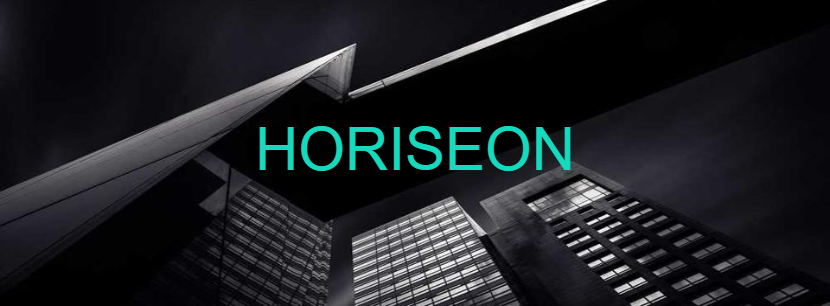

# Horiseon

## Digital Marketing Agency

## The company is activating in the marketing sector, specialising in social media marketing, search engine optimisation and online reputation management. We have built a professional website to promote the Agency's new services. This website will connect the Agency with potential customers from all over the world.

## This website will be used only as an introduction to our services. For a more in-depth view, please don't hesitate to get in contact with us.

## For a better understanding of the topic of Semantic HTML and the role this plays in making a website accessible for people with disabilities, I have used different websites and Youtube tutorials.
  
https://mailchimp.com/en-gb/resources/html-semantic-elements-and-webflow-the-essential-guide/

https://www.youtube.com/watch?v=kX3TfdUqpuU&
t=2s

## MIT License 

